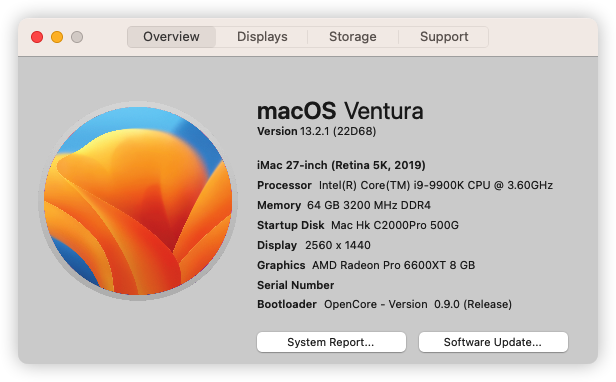
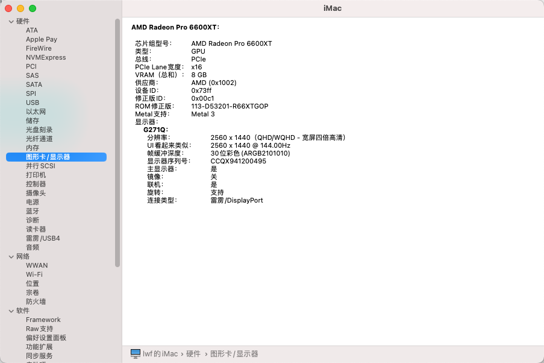
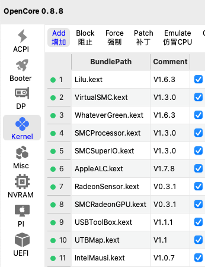
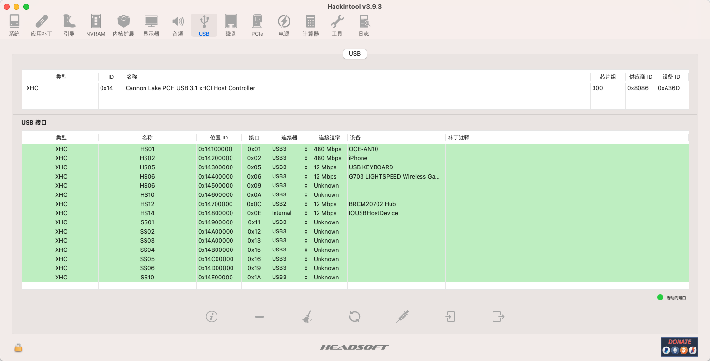

# Asus-TUF-Z390-9900K-6600XT-EFI
- 支持系统：Monterey 12.x、Ventura 13.x
- 请自行生成修改Board Serial Number、序列号、SmUUID等三码信息
- EFI [点击下载](https://github.com/lwf1127/Asus-TUF-Z390-9900K-6600XT-EFI/releases)

#### 20230220更新：

1. 解决在Windows下主板名称不正确的问题。参考：https://www.bilibili.com/read/cv9278654

#### 20230210更新：

1. 如在开机时发现主板自检阶段时间过长，显示器很久才能点亮，请在Kernel-》Quirks-》勾选：DisableRtcChecksum(禁用RTC校验)

#### 硬件配置：
- CPU ：i9-9900K
- 主板 ：华硕(ASUS)TUF Z390-PLUS GAMING (WI-FI) 电竞特工主板
- 内存 ：海盗船 DDR4 3600 8x2 16G
- 显卡 ：技嘉RX6600XT 魔鹰PRO
- 硬盘 ：海康威视 C2000Pro 500G
- 板载网卡：Intel有线网卡+Intel® Wireless-AC 9560
- 板载声卡：Realtek® S1200A
- 无线网卡：奋威T919 BCM94360CD
- 散热：利民 Magic EX 240水冷

#### BIOS设置：

- 【高级】 - 【CPU 设置】 - 【软件保护扩展（SGX）】- 【关闭】
- 【高级】 - 【CPU 设置】 - 【Intel VMX 虚拟化技术】 - 【开启】
- 【高级】 - 【CPU 设置】 - 【CPU-Power Management Control】 - 【CFG Lock】 - 【关闭】
- 【高级】 - 【北桥设置】 - 【VT-d】 - 【关闭】
- 【高级】 - 【北桥设置】 - 【大于4G地址空间解码】 - 【开启】
- 【高级】 - 【北桥设置】 - 【显示设置】 - 【首选显卡】 - 【auto】
- 【高级】 - 【北桥设置】 - 【显示设置】 - 【初始化iGPU】 - 【开启】
- 【高级】 - 【PCH存储设置】 - 【SATA摸式选择】 - 【AHCI】
- 【高级】 - 【USB Configuration】 - 【XHCI Hand-off】 - 【开启】
- 【启动】 - 【启动设置】- 【快速启动】 - 【关闭】
- 【启动】 - 【若出现错误等待按下F1键】  - 【关闭】
- 【启动】 - 【CSM(兼容性支特摸块)】 - 【开启CSM】 - 【关闭】
- 【启动】 - 【安全启动菜单】 - 【操作系统类型】 - 【其他操作系统】

#### 完善程度：
1. CPU 跑分正常，H264、HEVC硬解正常
2. USB 2.0 和3.0正常（两个后置USB未定制）
3. 有线网卡、WIFI、蓝牙正常
4. 支持隔空、通用控制、手机相机连续互通
5. 音频输出正常
6. 睡眠与唤醒正常
7. TRIM支持正常
8. USB额外操作电流、睡眠电流正常
9. 显卡Metal支持正常
10. CPU、显卡、风扇温度转速显示正常

#### 部分截图：

#### OpenCore & Kext：

#### USB定制：

#### 鸣谢：
- EFI参考：https://github.com/jhihhe/Hackintosh-Asus_Prime_Z390P-i9-9900K_UHD630-RX-6600XT-EFI_OpenCore-0.8.8-macOS
- 国光的黑苹果安装教程：https://apple.sqlsec.com/
- IT记：https://hackintosh.myitnote.com/
- OSX：https://osx.cx/
- 黑苹果星球：https://heipg.cn/
- 黑果小兵：https://blog.daliansky.net/Hackintosh-long-term-maintenance-model-checklist.html#asus-%E5%8D%8E%E7%A1%95-1
